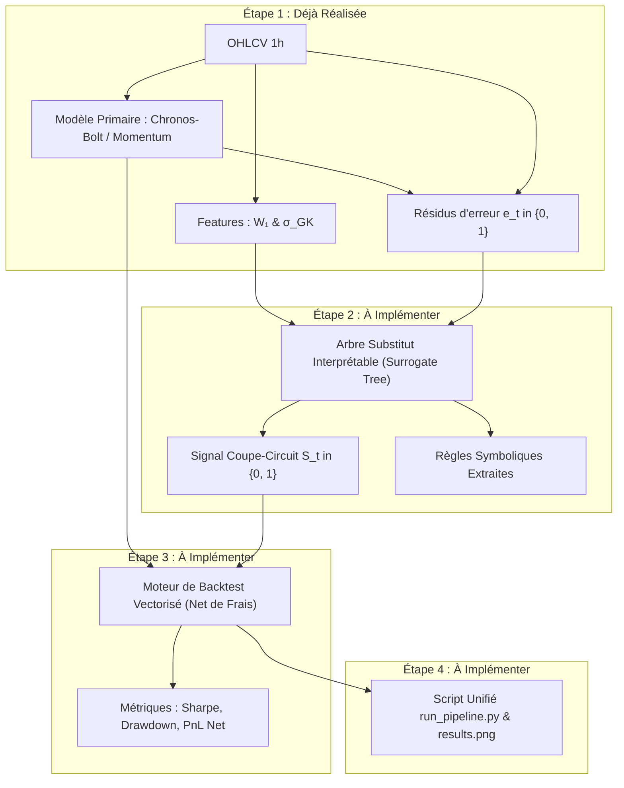

# Feuille de Route et Suite du Projet : Circuit-Breaker & Wasserstein 1D

Ce document formalise la feuille de route technique, mathématique et architecturale pour les prochaines étapes du projet quantitatif.

---

## 1. État d'Avancement Actuel

```
[✅ ÉTAPE 1 : PIPELINE DE DONNÉES & MODÈLE PRIMAIRE]
├── src/data_loader.py    : Téléchargement & cache des barres OHLCV 1h BTC/USDT (Binance / CCXT)
├── src/metrics.py        : Extraction vectorisée des métriques de régime :
│                           - Log-rendements : r_t = ln(P_t / P_{t-1})
│                           - Volatilité locale de Garman-Klass : sigma_{GK, t}
│                           - Distance de Wasserstein 1D : W_1(W_ref, W_curr)
└── src/primary_model.py  : Modèles primaires & calcul des résidus d'erreur :
                            - Baseline Momentum (3h)
                            - Foundation Model Zero-Shot : Amazon Chronos-Bolt
                            - Target future : y_t = sign(r_{t+1})
                            - Résidu binaire d'erreur : e_t = II(y_hat_t != y_t)
```

---

## 2. Vue d'Ensemble des Prochaines Étapes



---

## 3. Détail des Étapes à Venir

### Étape 2 : L'Arbre Substitut Interprétable (`src/circuit_breaker.py`)

#### Objectif
Entraîner un modèle interprétable (White-Box) chargé de détecter les régimes de marché instables où le modèle primaire s'effondre.

#### Formulation Mathématique
Soit le vecteur de caractéristiques de régime $X_t = [d_{\mathcal{W}, t}, \, \sigma_{GK, t}]$ :
- $d_{\mathcal{W}, t}$ : distance 1D de Wasserstein entre la fenêtre courante ($M=30\text{h}$) et de référence ($N=200\text{h}$).
- $\sigma_{GK, t}$ : volatilité intra-bougie de Garman-Klass.

On ajuste un arbre de décision contraint :
$$\hat{e}_t = f_{\text{tree}}(X_t) = \mathbb{P}(e_t = 1 \mid X_t)$$

Avec les hyperparamètres de régularisation :
- `max_depth = 2` (profondeur limitée pour garantir des règles simples).
- `min_samples_leaf = 50` (éviter le surapprentissage sur de micro-clusters).

#### Décision du Coupe-Circuit ($S_t$)
Pour un seuil d'erreur critique $\tau$ (par défaut $\tau \approx 0.50$ à $0.53$) :

$$S_t = \begin{cases} 0 \quad (\text{Coupe-circuit activé : 100\% Cash}) & \text{si } \mathbb{P}(e_t = 1 \mid X_t) \ge \tau \\ 1 \quad (\text{Signal autorisé : Trade actif}) & \text{si } \mathbb{P}(e_t = 1 \mid X_t) < \tau \end{cases}$$

#### Livrable Attendu
- `src/circuit_breaker.py` : classe `WassersteinCircuitBreaker` implémentant `fit()`, `predict()`, `predict_proba()` et `explain_rules()`.

---

### Étape 3 : Moteur de Backtest Vectorisé Net de Frais (`src/backtest.py`)

#### Objectif
Valider empiriquement que le filtrage par le coupe-circuit surperforme le modèle brut après déduction des coûts de transaction.

#### Formulation des Expositions
1. **Stratégie Brute (Non filtrée)** :
   $$\text{pos}_{\text{brute}, t} = \hat{y}_t \in \{-1, +1\}$$
2. **Stratégie Filtrée (Avec Coupe-Circuit)** :
   $$\text{pos}_{\text{filtrée}, t} = \hat{y}_t \times S_t \in \{-1, 0, +1\}$$

#### Modélisation des Frictions Réalistes
Les frais de transaction $\mathcal{C}$ sont fixés à **10 bps (0.10 %)** par turnover de position :

$$\Delta \text{pos}_t = |\text{pos}_t - \text{pos}_{t-1}|$$
$$\text{frais}_t = c_{\text{rate}} \times \Delta \text{pos}_t \quad \text{avec } c_{\text{rate}} = 0.0010$$

Le rendement net de la stratégie à l'instant $t$ s'écrit :
$$r_{\text{strat}, t} = \text{pos}_{t-1} \cdot r_t - \text{frais}_t$$

#### Métriques d'Évaluation
- **Sharpe Ratio Annualisé** :
  $$\text{Sharpe} = \sqrt{8760} \cdot \frac{\mathbb{E}[r_{\text{strat}}]}{\sigma(r_{\text{strat}})}$$
- **Maximum Drawdown (MDD)** :
  $$\text{MDD} = \max_{t} \left( \frac{\max_{s \le t} \text{Equity}_s - \text{Equity}_t}{\max_{s \le t} \text{Equity}_s} \right)$$
- **Taux d'Inactivité (Cash Ratio)** :
  $$\% \text{ Cash} = \frac{1}{T} \sum_{t=1}^T \mathbb{I}(S_t = 0)$$

#### Livrable Attendu
- `src/backtest.py` : fonction `run_vectorized_backtest(df, cost_bps=10)`.

---

### Étape 4 : Pipeline Unifié & Visualisation (`run_pipeline.py`)

#### Objectif
Fournir un point d'entrée unique reproduisant l'expérience complète et générant le graphique d'analyse comparative.

#### Visualisation (`results.png`)
Un graphique 3-panneaux :
1. **Panneau 1 : Courbes d'équité (PnL Net cumulé)** :
   - Stratégie Brute (Chronos-Bolt seul).
   - Stratégie Filtrée (+ Wasserstein Circuit-Breaker).
   - Benchmark Buy & Hold BTC.
2. **Panneau 2 : Dynamique du Coupe-Circuit** :
   - Cours du BTC avec mise en surbrillance rouge des périodes où le coupe-circuit a basculé à 100% en Cash.
3. **Panneau 3 : Évolution temporelle de la divergence $W_1$** :
   - Distance de Wasserstein $W_1$ au cours du temps et seuil critique identifié par l'arbre.

---

## 4. Tableau Récapitulatif des Livrables

| Étape | Fichier | Description | Statut |
| :--- | :--- | :--- | :--- |
| **1.1** | `src/data_loader.py` | Téléchargement & mise en cache OHLCV 1h | ✅ Fait |
| **1.2** | `src/metrics.py` | Calcul de $r_t$, $\sigma_{GK}$, $W_1$ | ✅ Fait |
| **1.3** | `src/primary_model.py` | Modèles Momentum, Chronos-Bolt et $e_t$ | ✅ Fait |
| **2** | `src/circuit_breaker.py` | Entraînement de l'arbre substitut & signal $S_t$ | ✅ Fait & Validé |
| **3** | `src/backtest.py` | Backtest vectorisé net de frais (10 bps) | ✅ **Fait & Validé** |
| **4** | `run_pipeline.py` | Pipeline unifié & génération de `results.png` | ✅ **Fait & Validé** |
